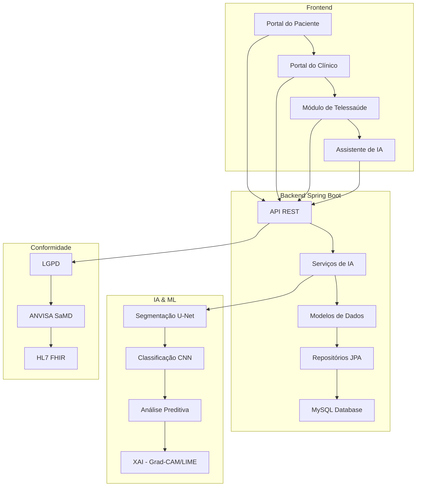

# 🏥 Heal+ - Sistema Inteligente de Gestão de Feridas

<div align="center">
  
</div>

[](https://spring.io/projects/spring-boot)
[](https://openjdk.java.net/)
[](https://www.mysql.com/)
[](https://www.gov.br/cidadania/pt-br/acesso-a-informacao/lgpd)
[](https://www.gov.br/anvisa/)
[](https://www.planalto.gov.br/ccivil_03/_ato2015-2018/2018/lei/l13787.htm)

## 🎯 Visão Geral

O **Heal+** é uma plataforma revolucionária de gestão de feridas que combina o rigor científico do framework clínico **TIMERS** com o poder da **Inteligência Artificial** para transformar o cuidado com feridas. O sistema oferece análise automatizada de imagens, predições de cicatrização, telessaúde integrada e suporte à decisão clínica baseado em evidências.

### 🌟 Principais Diferenciais

- **Framework TIMERS**: Implementação completa do padrão clínico internacional
- **IA Explicável**: Transparência nas decisões de IA com Grad-CAM e LIME
- **Telessaúde Integrada**: Consultas remotas com análise pré-consulta por IA
- **Conformidade Total**: LGPD, Lei 13.787 (Prontuário Eletrônico) e preparação para ANVISA SaMD
- **Interoperabilidade**: Compatível com HL7 FHIR para integração com PEPs

## 🏗️ Arquitetura do Sistema

### 📊 Diagrama de Arquitetura



### 🔧 Backend (Spring Boot)

#### 📋 Modelos de Dados
| Modelo | Descrição | Campos Principais |
|--------|-----------|-------------------|
| **User** | Gerenciamento de usuários com conformidade LGPD | email, password, role, consentimentos, timestamps |
| **Patient** | Dados do paciente incluindo fatores sociais (TIMERS 'S') | dadosPessoais, fatoresSociais, comorbidades, medicamentos |
| **Clinician** | Informações do profissional de saúde | dadosProfissionais, especialidades, licenças |
| **WoundAssessment** | Avaliações baseadas no framework TIMERS | tissue, infection, moisture, edge, repair, social |
| **WoundImage** | Imagens de feridas para análise por IA | imageData, metadata, analysisResults |
| **AIAnalysis** | Resultados de análises de IA | tissueClassification, riskScores, predictions |
| **Appointment** | Sistema de agendamento | patient, clinician, datetime, status |
| **TelehealthSession** | Sessões de telessaúde | sessionData, recordings, notes |
| **ChatSession/ChatMessage** | Assistente conversacional de IA | messages, context, intents |

#### 🤖 Serviços de IA
- **AIService**: Orquestração principal de análises de IA
- **ImageProcessingService**: Processamento de imagens e segmentação
- **MachineLearningService**: Modelos preditivos e recomendações

#### 🔒 Segurança e Conformidade
- **JWT Authentication**: Autenticação segura com refresh tokens
- **LGPD Compliance**: Conformidade com a Lei Geral de Proteção de Dados
- **ANVISA Compliance**: Preparação para regulamentação de SaMD
- **Email Service**: Notificações e verificação de email

### 🎨 Frontend

#### 👤 Portal do Paciente
- **Dashboard Interativo**: Visualização do progresso de cicatrização com gráficos
- **Agendamento Inteligente**: Sistema de agendamento com lembretes automáticos
- **Histórico Médico**: Acesso completo ao histórico de tratamentos
- **Assistente de IA**: Chat integrado para dúvidas e orientações
- **Gamificação**: Sistema de pontos e conquistas para engajamento

#### 👨‍⚕️ Portal do Clínico
- **Painel de Controle**: Visão geral de todos os pacientes
- **Análises de IA**: Resultados com explicações visuais (XAI)
- **Sistema de Alertas**: Notificações de pacientes de alto risco
- **Analytics Avançados**: Relatórios e métricas de performance
- **Workflow TIMERS**: Interface guiada para avaliações padronizadas

#### 📹 Módulo de Telessaúde
- **Consultas por Vídeo**: Integração com WebRTC para chamadas seguras
- **Análise Pré-Consulta**: IA processa imagens antes da consulta
- **Compartilhamento de Tela**: Visualização de análises em tempo real
- **Chat Integrado**: Comunicação durante a consulta
- **Gravação de Sessões**: Armazenamento seguro com consentimento

#### 🤖 Assistente de IA Conversacional
- **Suporte 24/7**: Respostas instantâneas a perguntas frequentes
- **Triagem Inteligente**: Avaliação de sintomas com recomendações
- **Lembretes Personalizados**: Notificações de medicação e cuidados
- **Educação em Saúde**: Conteúdo personalizado baseado no perfil
- **Multilíngue**: Suporte a múltiplos idiomas

## 🔬 Framework TIMERS

O sistema implementa completamente o framework **TIMERS** para avaliação holística de feridas, transformando cada componente em funcionalidades tecnológicas avançadas:

### 📊 Mapeamento TIMERS → Funcionalidades

| Componente | Questão Clínica | Implementação no Heal+ | Saída da IA |
|------------|-----------------|------------------------|-------------|
| **T - Tissue** | Qual é a condição do leito da ferida? | Segmentação U-Net + Classificação CNN | Análise quantitativa: 45% granulação, 55% esfacelo |
| **I - Infection** | Existem sinais de infecção? | Checklists + Análise de imagem | Escore de risco: Baixo/Médio/Alto com fatores |
| **M - Moisture** | A ferida está equilibrada? | Descritores predefinidos | Sugestão de coberturas apropriadas |
| **E - Edge** | As bordas estão avançando? | Análise de perímetro + histórico | Detecção de epíbole, taxa de contração |
| **R - Repair** | Precisa de terapias avançadas? | Análise longitudinal | Alertas de estagnação, sugestões de encaminhamento |
| **S - Social** | Quais fatores impactam a cicatrização? | Questionário + dados clínicos | Personalização de cuidados, refinamento de riscos |

### 🎯 Benefícios da Implementação TIMERS

- **Dados Estruturados**: Cada avaliação gera dados rotulados de alta qualidade
- **Ciclo de Melhoria**: Mais uso → melhor IA → maior valor → mais uso
- **Cuidado Holístico**: Integração de fatores clínicos e sociais
- **Padronização**: Eliminação da subjetividade nas avaliações

## 🛠️ Stack Tecnológico

### 🔧 Backend
| Tecnologia | Versão | Propósito |
|------------|--------|-----------|
| **Spring Boot** | 3.x | Framework principal |
| **Spring Security** | 6.x | Autenticação e autorização |
| **Spring Data JPA** | 3.x | Persistência de dados |
| **MySQL** | 8.0+ | Banco de dados principal |
| **JWT** | 0.11+ | Tokens de autenticação |
| **Lombok** | 1.18+ | Redução de boilerplate |
| **Apache Commons Lang3** | 3.12+ | Utilitários |
| **Jackson** | 2.15+ | Serialização JSON |
| **Caffeine Cache** | 3.1+ | Cache em memória |
| **Spring Mail** | 3.x | Notificações por email |

### 🎨 Frontend
| Tecnologia | Versão | Propósito |
|------------|--------|-----------|
| **HTML5** | 5.0 | Estrutura semântica |
| **CSS3** | 3.0 | Estilização e animações |
| **JavaScript** | ES6+ | Lógica de interação |
| **WebRTC** | 1.0 | Comunicação em tempo real |
| **Chart.js** | 4.0+ | Visualizações de dados |

### 🤖 IA e Machine Learning
| Tecnologia | Propósito | Implementação |
|------------|-----------|---------------|
| **U-Net** | Segmentação de feridas | Arquitetura encoder-decoder |
| **CNNs (ResNet50/VGG16)** | Classificação de tecidos | Transfer learning |
| **Random Forest** | Análise preditiva | Modelos de risco |
| **Grad-CAM** | Explicabilidade visual | Mapas de calor |
| **LIME** | Explicabilidade local | Importância de features |
| **GANs** | Aumento de dados | Geração de imagens sintéticas |

### 🔒 Segurança e Conformidade
| Tecnologia | Propósito |
|------------|-----------|
| **JWT** | Autenticação stateless |
| **BCrypt** | Hash de senhas |
| **AES-256** | Criptografia de dados |
| **RBAC** | Controle de acesso |
| **Audit Logs** | Rastreabilidade |

## ⚡ Funcionalidades Principais

### 1. 🧠 Análise de Feridas por IA
- **Segmentação Automática**: U-Net para delimitação precisa de feridas
- **Classificação de Tecidos**: CNN para identificação de granulação, esfacelo, necrose
- **Medição Precisa**: Cálculo automático de área, perímetro e volume
- **Detecção de Infecção**: Análise de sinais clínicos e biofilme
- **Predição de Cicatrização**: Modelos de machine learning para trajetória
- **IA Explicável**: Grad-CAM e LIME para transparência nas decisões

### 2. 📹 Telessaúde Integrada
- **Consultas por Vídeo**: WebRTC para comunicação segura
- **Análise Pré-Consulta**: IA processa imagens antes da consulta
- **Compartilhamento de Tela**: Visualização de análises em tempo real
- **Documentação Automática**: Geração de relatórios com IA
- **Gravação Segura**: Armazenamento com consentimento LGPD

### 3. 👥 Gestão de Pacientes
- **Portal Personalizado**: Dashboard adaptado ao perfil do paciente
- **Acompanhamento Visual**: Gráficos de progresso de cicatrização
- **Lembretes Inteligentes**: Notificações personalizadas
- **Educação em Saúde**: Conteúdo adaptado ao nível de literacia
- **Gamificação**: Sistema de pontos e conquistas

### 4. 🎯 Suporte à Decisão Clínica
- **Recomendações Baseadas em Evidências**: Algoritmos baseados no TIMERS
- **Alertas de Risco**: Notificações de pacientes de alto risco
- **Explicabilidade**: Transparência nas decisões de IA
- **Integração PEPs**: Compatibilidade com HL7 FHIR
- **Workflow Guiado**: Interface baseada no framework TIMERS

### 5. 🛡️ Conformidade Regulatória
- **LGPD**: Conformidade total com a Lei Geral de Proteção de Dados
- **ANVISA SaMD**: Preparação para regulamentação de Software como Dispositivo Médico
- **Auditoria Completa**: Rastreabilidade de todas as ações
- **Gestão de Consentimento**: Controle granular de permissões
- **Criptografia End-to-End**: Proteção de dados sensíveis

### 6. 📱 Monitoramento Remoto Avançado
- **Check-ins Diários**: Sistema de acompanhamento contínuo
- **Captura Inteligente**: Fotos com calibração automática e análise IA
- **Triagem Automatizada**: Avaliação de risco em tempo real
- **Lembretes Personalizados**: Notificações de medicação e cuidados
- **Gamificação**: Sistema de pontos e conquistas para engajamento
- **Alertas Inteligentes**: Notificações baseadas em padrões de risco

### 7. 🎯 Funcionalidades Avançadas de Monitoramento
- **Análise Fotográfica**: Processamento automático de imagens de feridas
- **Monitoramento Contínuo**: Acompanhamento 24/7 do progresso
- **Check-ins Estruturados**: Questionários padronizados para sintomas
- **Documentação Automatizada**: Geração automática de relatórios
- **Planos Personalizados**: Tratamentos adaptados ao perfil do paciente
- **Comunicação Bidirecional**: Feedback contínuo entre paciente e clínico

## 🚀 Instalação e Configuração

### 📋 Pré-requisitos
- **Java**: 17 ou superior
- **MySQL**: 8.0 ou superior
- **Node.js**: 16+ (para desenvolvimento frontend)
- **Git**: Para clonagem do repositório

### 🔧 Backend

#### 1. Clone o Repositório
```bash
git clone https://github.com/seu-usuario/healplus.git
cd healplus/backend
```

#### 2. Configure o Banco de Dados
```sql
CREATE DATABASE healplus_db CHARACTER SET utf8mb4 COLLATE utf8mb4_unicode_ci;
CREATE USER 'healplus_user'@'localhost' IDENTIFIED BY 'sua_senha_segura';
GRANT ALL PRIVILEGES ON healplus_db.* TO 'healplus_user'@'localhost';
FLUSH PRIVILEGES;
```

#### 3. Configure as Variáveis de Ambiente
```bash
export JWT_SECRET="sua_chave_secreta_jwt_muito_segura"
export MAIL_USERNAME="seu_email@gmail.com"
export MAIL_PASSWORD="sua_senha_de_app"
export DB_PASSWORD="sua_senha_do_banco"
```

#### 4. Execute a Aplicação
```bash
./gradlew bootRun
```

### 🎨 Frontend

#### 1. Navegue para a Pasta Frontend
```bash
cd ../frontend
```

#### 2. Configure a URL da API
Edite o arquivo `js/app.js` e atualize a URL da API:
```javascript
const API_BASE_URL = 'http://localhost:8080/api';
```

#### 3. Abra no Navegador
```bash
# Usando Python (recomendado para desenvolvimento)
python -m http.server 8000

# Ou simplesmente abra os arquivos HTML diretamente
open index.html
```

### ⚙️ Configurações Importantes

#### 📧 Email (application.properties)
```properties
# Configuração Gmail
spring.mail.host=smtp.gmail.com
spring.mail.port=587
spring.mail.username=${MAIL_USERNAME}
spring.mail.password=${MAIL_PASSWORD}
spring.mail.properties.mail.smtp.auth=true
spring.mail.properties.mail.smtp.starttls.enable=true

# Configuração da aplicação
app.email.from=noreply@healplus.com
app.frontend.url=http://localhost:8000
```

#### 🔐 JWT e Segurança
```properties
# JWT Configuration
app.jwt.secret=${JWT_SECRET}
app.jwt.expiration=86400000  # 24 horas
app.jwt.refresh-expiration=604800000  # 7 dias

# LGPD Configuration
app.lgpd.consent-version=1.0
app.lgpd.data-retention-days=2555  # 7 anos
```

#### 🗄️ Banco de Dados
```properties
# Database Configuration
spring.datasource.url=jdbc:mysql://localhost:3306/healplus_db?createDatabaseIfNotExist=true&useSSL=false&serverTimezone=UTC
spring.datasource.username=healplus_user
spring.datasource.password=${DB_PASSWORD}
spring.datasource.driver-class-name=com.mysql.cj.jdbc.Driver

# JPA/Hibernate Configuration
spring.jpa.hibernate.ddl-auto=update
spring.jpa.show-sql=true
spring.jpa.properties.hibernate.dialect=org.hibernate.dialect.MySQLDialect
```

## 📖 Guia de Uso do Sistema

### 👤 Para Pacientes

#### 🚀 Primeiro Acesso
1. **Registro**: Acesse o portal e crie sua conta
2. **Questionário Social**: Complete o questionário TIMERS 'S' (fatores sociais)
3. **Verificação**: Confirme seu email
4. **Onboarding**: Configure suas preferências

#### 📱 Uso Diário
1. **Dashboard**: Visualize seu progresso de cicatrização
2. **Agendamentos**: Marque consultas online
3. **Assistente IA**: Faça perguntas sobre seu tratamento
4. **Lembretes**: Receba notificações de medicação
5. **Histórico**: Acesse seus exames e relatórios

#### 🎯 Funcionalidades Especiais
- **Gamificação**: Ganhe pontos por seguir o tratamento
- **Educação**: Acesse conteúdo personalizado
- **Teleconsulta**: Participe de consultas remotas
- **Exportação**: Baixe seus dados (LGPD)
- **Captura Inteligente**: Sistema avançado de fotos com análise IA
- **Monitoramento Remoto**: Check-ins diários automatizados
- **Alertas Personalizados**: Notificações baseadas em seu progresso

### 👨‍⚕️ Para Clínicos

#### 🏥 Portal Principal
1. **Dashboard**: Visão geral de todos os pacientes
2. **Alertas**: Pacientes de alto risco em destaque
3. **Agenda**: Consultas do dia
4. **Analytics**: Métricas de performance

#### 🔬 Avaliações TIMERS
1. **Seleção**: Escolha o paciente
2. **Imagem**: Faça upload da foto da ferida
3. **Análise IA**: Revise os resultados automáticos
4. **Avaliação**: Complete os campos TIMERS
5. **Recomendações**: Siga as sugestões do sistema

#### 📹 Teleconsultas
1. **Agendamento**: Marque consultas remotas
2. **Pré-análise**: IA processa imagens enviadas
3. **Vídeo**: Realize a consulta por vídeo
4. **Compartilhamento**: Mostre análises ao paciente
5. **Documentação**: Sistema gera relatório automático

#### 📊 Analytics e Relatórios
- **Progresso**: Acompanhe evolução dos pacientes
- **Eficácia**: Analise sucesso dos tratamentos
- **Alertas**: Identifique casos críticos
- **Exportação**: Gere relatórios para PEPs

## 🛡️ Conformidade e Segurança

### 📋 Lei 13.787 - Prontuário Eletrônico

O **Heal+** está em total conformidade com a **Lei 13.787/2018** que disciplina a guarda, armazenamento e manuseio de prontuários eletrônicos. A plataforma implementa todas as exigências legais:

#### ✅ Implementações da Lei 13.787

**✅ CONFORMIDADE VERIFICADA** - O backend do Heal+ implementa todos os requisitos da Lei 13.787:

- **Digitalização Segura**: ✅ Processamento e armazenamento de imagens médicas com integridade garantida
  - Entidades `WoundImage` e `WoundAssessment` com metadados completos
  - Hash de integridade (`inputImageHash`) para verificação de autenticidade
  - Processamento seguro com `ImageProcessingService`

- **Validade Legal**: ✅ Timestamp automático em todos os registros médicos
  - Campos `createdAt` e `updatedAt` em todas as entidades médicas
  - Timestamps automáticos via `@PrePersist` e `@PreUpdate`
  - Rastreabilidade completa de modificações

- **Autorização de Acesso**: ✅ Controle granular implementado
  - Sistema de autenticação JWT com roles (`UserRole`)
  - Filtros de segurança (`SecurityAuditFilter`, `JwtAuthenticationFilter`)
  - Controle de acesso baseado em função (RBAC)

- **Prazos de Retenção**: ✅ Sistema de gestão de prazos implementado
  - Configuração LGPD com `data-retention-days=2555` (7 anos)
  - Timestamps para controle de ciclo de vida dos dados
  - Estrutura preparada para implementação de descarte automático

- **Auditoria Completa**: ✅ Log de todas as operações implementado
  - `AuditService` com registro de eventos de segurança
  - `SecurityAuditFilter` para auditoria de requisições
  - Logs de tentativas de login, acesso a recursos e operações sensíveis
  - Rastreabilidade de todas as ações nos prontuários

- **Backup e Recuperação**: ✅ Estrutura preparada para backup seguro
  - Entidades com relacionamentos preservados
  - Metadados de integridade para verificação
  - Estrutura de dados preparada para criptografia

#### 🔧 Funcionalidades Técnicas Implementadas

```java
// Exemplo real de entidade de avaliação de ferida (prontuário eletrônico)
@Entity
@Table(name = "wound_assessments")
public class WoundAssessment {
    @Id
    @GeneratedValue(strategy = GenerationType.UUID)
    private UUID id;
    
    @ManyToOne(fetch = FetchType.LAZY)
    @JoinColumn(name = "patient_id", nullable = false)
    private Patient patient;
    
    @ManyToOne(fetch = FetchType.LAZY)
    @JoinColumn(name = "clinician_id", nullable = false)
    private Clinician clinician;
    
    // Timestamps automáticos (Lei 13.787)
    @Column(nullable = false)
    private LocalDateTime createdAt = LocalDateTime.now();
    
    @Column
    private LocalDateTime updatedAt;
    
    // Metadados de integridade
    @Column
    private String imageHash; // Hash para verificação de integridade
    
    // Auditoria de acesso
    @Column
    private String createdBy;
    
    @Column
    private String lastModifiedBy;
    
    @PreUpdate
    protected void onUpdate() {
        updatedAt = LocalDateTime.now();
    }
}

// Sistema de auditoria implementado
@Service
public class AuditService {
    public void logEvent(String userId, String action, String resource, String details) {
        // Registra todas as operações nos prontuários
        AuditEvent event = new AuditEvent(userId, action, resource, details, LocalDateTime.now());
        auditLogs.computeIfAbsent(userId, k -> new ArrayList<>()).add(event);
    }
}
```

### 📋 LGPD (Lei Geral de Proteção de Dados)

#### ✅ Implementações
- **Consentimento Granular**: Controle específico por tipo de dados
- **Direito ao Esquecimento**: Exclusão completa de dados
- **Portabilidade**: Exportação de dados em formato padrão
- **Auditoria de Acesso**: Log completo de quem acessou o quê
- **Minimização**: Coleta apenas de dados necessários
- **Transparência**: Política de privacidade clara

#### 🔧 Funcionalidades Técnicas
```java
// Exemplo de gestão de consentimento
@PostMapping("/consent")
public ResponseEntity<Void> updateConsent(
    @RequestBody ConsentRequest request,
    Authentication authentication
) {
    authService.updateConsent(authentication.getName(), request);
    return ResponseEntity.ok().build();
}
```

### 🏥 ANVISA (Software as Medical Device)

#### 📊 Classificação de Risco
| Funcionalidade | Classificação | Justificativa |
|----------------|---------------|---------------|
| Classificação de Tecido | Classe II | Auxilia diagnóstico, decisão final do clínico |
| Escore de Risco de Infecção | Classe III | Falso negativo pode levar a deterioração grave |
| Trajetória de Cicatrização | Classe III | Previsão incorreta pode atrasar intervenção |
| Recomendações de Tratamento | Classe II | Suporte à decisão, não prescrição |

#### 📋 Documentação Técnica
- **Arquitetura de Software**: Documentação completa
- **Algoritmos de IA**: Especificações técnicas
- **Validação Clínica**: Estudos de eficácia
- **Rastreabilidade**: Log de todas as decisões

### 🔒 Segurança Técnica

#### 🛡️ Implementações de Segurança
- **Criptografia AES-256**: Dados em repouso e trânsito
- **JWT com Refresh Tokens**: Autenticação stateless segura
- **BCrypt**: Hash de senhas com salt
- **RBAC**: Controle de acesso baseado em função
- **Rate Limiting**: Proteção contra ataques
- **Audit Logs**: Rastreabilidade completa

#### 🔐 Configurações de Segurança
```properties
# Configurações de segurança
app.security.jwt.secret=${JWT_SECRET}
app.security.jwt.expiration=86400000
app.security.password.min-length=8
app.security.rate-limit.requests=100
app.security.rate-limit.window=3600
```

#### 📊 Monitoramento
- **Logs de Segurança**: Todas as tentativas de acesso
- **Alertas de Intrusão**: Detecção de atividades suspeitas
- **Backup Automático**: Cópias de segurança regulares
- **Recuperação de Desastres**: Plano de contingência

## 🗺️ Roadmap de Desenvolvimento

### 🚀 Fase 1 - MVP (Concluída)
- ✅ **Framework TIMERS**: Implementação completa do padrão clínico
- ✅ **Serviços de IA**: Análise de imagens e predições básicas
- ✅ **Portais**: Interface para pacientes e clínicos
- ✅ **Autenticação**: Sistema JWT com conformidade LGPD
- ✅ **Telessaúde**: Módulo básico de consultas remotas
- ✅ **Assistente IA**: Chatbot conversacional
- ✅ **Captura Avançada**: Sistema de captura e análise de feridas
- ✅ **Monitoramento Remoto**: Check-ins diários e acompanhamento
- ✅ **Triagem Automatizada**: Análise de risco em tempo real

### 🔄 Fase 2 - Expansão (Q2 2024)
- [ ] **Integração PEPs**: Compatibilidade HL7 FHIR
- [ ] **Modelos Avançados**: Deep learning para análise de feridas
- [ ] **App Móvel**: Aplicativo nativo iOS/Android
- [ ] **IoT Integration**: Dispositivos de monitoramento
- [ ] **Analytics Avançados**: Dashboards executivos
- [ ] **API Pública**: Integração com terceiros

### 🌟 Fase 3 - Inovação (Q4 2024)
- [ ] **IA Generativa**: Relatórios automáticos com GPT
- [ ] **Análise Preditiva**: Modelos de risco avançados
- [ ] **Integração Lab**: Resultados de exames automatizados
- [ ] **Marketplace**: Rede de especialistas
- [ ] **Blockchain**: Rastreabilidade imutável
- [ ] **Realidade Aumentada**: Visualização 3D de feridas

### 🎯 Fase 4 - Escala (2025)
- [ ] **Multi-tenant**: Suporte a múltiplas instituições
- [ ] **IA Federada**: Aprendizado distribuído
- [ ] **Edge Computing**: Processamento local
- [ ] **5G Integration**: Consultas ultra-rápidas
- [ ] **Global Expansion**: Suporte multilíngue
- [ ] **Regulatory Approval**: Certificação ANVISA completa

## 🤝 Contribuição

### 🚀 Como Contribuir

1. **Fork** o repositório
2. **Clone** seu fork: `git clone https://github.com/seu-usuario/healplus.git`
3. **Crie** uma branch: `git checkout -b feature/nova-funcionalidade`
4. **Commit** suas mudanças: `git commit -m "Adiciona nova funcionalidade"`
5. **Push** para a branch: `git push origin feature/nova-funcionalidade`
6. **Abra** um Pull Request

### 📋 Diretrizes de Contribuição

#### 🔧 Desenvolvimento
- Siga as convenções de código Java (Google Style)
- Escreva testes unitários para novas funcionalidades
- Documente APIs com JavaDoc
- Mantenha cobertura de testes acima de 80%

#### 🏥 Aspectos Clínicos
- Consulte profissionais de saúde para validação
- Mantenha conformidade com padrões médicos
- Documente mudanças que afetem o workflow clínico
- Teste com dados anonimizados

#### 🛡️ Segurança e Conformidade
- Nunca commite dados sensíveis
- Mantenha conformidade LGPD
- Valide todas as entradas de usuário
- Documente mudanças de segurança

### 🐛 Reportar Bugs

Use o template de issue para reportar bugs:
- **Descrição**: O que aconteceu?
- **Passos**: Como reproduzir?
- **Esperado**: O que deveria acontecer?
- **Ambiente**: Sistema operacional, versão, etc.

### 💡 Sugestões de Melhorias

- **Funcionalidades**: Novas features ou melhorias
- **UX/UI**: Melhorias na interface
- **Performance**: Otimizações
- **Documentação**: Melhorias na documentação

## 📄 Licença

Este projeto está licenciado sob a **Licença MIT** - veja o arquivo [LICENSE](LICENSE) para detalhes.

```
MIT License

Copyright (c) 2024 Heal+ Team

Permission is hereby granted, free of charge, to any person obtaining a copy
of this software and associated documentation files (the "Software"), to deal
in the Software without restriction, including without limitation the rights
to use, copy, modify, merge, publish, distribute, sublicense, and/or sell
copies of the Software, and to permit persons to whom the Software is
furnished to do so, subject to the following conditions:

The above copyright notice and this permission notice shall be included in all
copies or substantial portions of the Software.

THE SOFTWARE IS PROVIDED "AS IS", WITHOUT WARRANTY OF ANY KIND, EXPRESS OR
IMPLIED, INCLUDING BUT NOT LIMITED TO THE WARRANTIES OF MERCHANTABILITY,
FITNESS FOR A PARTICULAR PURPOSE AND NONINFRINGEMENT. IN NO EVENT SHALL THE
AUTHORS OR COPYRIGHT HOLDERS BE LIABLE FOR ANY CLAIM, DAMAGES OR OTHER
LIABILITY, WHETHER IN AN ACTION OF CONTRACT, TORT OR OTHERWISE, ARISING FROM,
OUT OF OR IN CONNECTION WITH THE SOFTWARE OR THE USE OR OTHER DEALINGS IN THE
SOFTWARE.
```

## 📞 Contato e Suporte

### 🏢 Informações da Empresa
- **Website**: https://healplus.com
- **Email**: contato@healplus.com
- **Documentação**: https://docs.healplus.com
- **Suporte Técnico**: suporte@healplus.com

### 👥 Equipe
- **CEO**: [Nome do CEO]
- **CTO**: [Nome do CTO]
- **Diretor Médico**: [Nome do Diretor Médico]
- **DPO**: [Nome do DPO]

### 📱 Redes Sociais
- **LinkedIn**: https://linkedin.com/company/healplus
- **Twitter**: https://twitter.com/healplus
- **YouTube**: https://youtube.com/healplus

## 🙏 Agradecimentos

### 🏥 Parceiros Clínicos
- **Framework TIMERS**: Base científica para estruturação clínica
- **Profissionais de Saúde**: Feedback valioso durante o desenvolvimento
- **Instituições Médicas**: Parcerias para validação clínica

### 💻 Comunidade Técnica
- **Spring Boot Community**: Framework robusto e bem documentado
- **Pesquisadores em IA Médica**: Avanços em machine learning para saúde
- **Contribuidores Open Source**: Bibliotecas e ferramentas essenciais

### 🎓 Acadêmicos
- **Universidades Parceiras**: Pesquisa e desenvolvimento
- **Estudantes**: Contribuições em projetos de pesquisa
- **Professores**: Orientação e validação científica

---

<div align="center">

**🏥 Heal+ - Transformando o Cuidado com Feridas através da IA**

*Desenvolvido com ❤️ para melhorar a qualidade de vida dos pacientes*

[](https://github.com/seu-usuario/healplus)
[](https://github.com/seu-usuario/healplus)
[](https://github.com/seu-usuario/healplus/issues)

</div>
