# Diagrama UML - Casos de Uso Heal+

## Diagrama de Casos de Uso

```mermaid
graph TB
    %% Atores
    Paciente[👤 Paciente]
    Profissional[👨‍⚕️ Profissional de Saúde]
    Administrador[👨‍💼 Administrador]
    Sistema[🤖 Sistema de IA]
    
    %% Casos de Uso - Gestão de Pacientes
    subgraph "Gestão de Pacientes"
        UC1[Registrar Paciente]
        UC2[Atualizar Dados do Paciente]
        UC3[Consultar Paciente]
        UC4[Listar Pacientes]
        UC5[Excluir Paciente]
    end
    
    %% Casos de Uso - Gestão de Profissionais
    subgraph "Gestão de Profissionais"
        UC6[Registrar Profissional]
        UC7[Atualizar Dados do Profissional]
        UC8[Consultar Profissional]
        UC9[Listar Profissionais]
    end
    
    %% Casos de Uso - Agendamentos
    subgraph "Sistema de Agendamentos"
        UC10[Agendar Consulta]
        UC11[Confirmar Agendamento]
        UC12[Reagendar Consulta]
        UC13[Cancelar Agendamento]
        UC14[Consultar Agenda]
        UC15[Enviar Lembrete]
    end
    
    %% Casos de Uso - Avaliação TIMERS
    subgraph "Avaliação TIMERS"
        UC16[Iniciar Avaliação]
        UC17[Avaliar Tecido - T]
        UC18[Avaliar Infecção - I]
        UC19[Avaliar Umidade - M]
        UC20[Avaliar Bordas - E]
        UC21[Avaliar Reparo - R]
        UC22[Avaliar Fatores Sociais - S]
        UC23[Salvar Avaliação]
        UC24[Editar Avaliação]
    end
    
    %% Casos de Uso - Gestão de Feridas
    subgraph "Gestão de Feridas"
        UC25[Registrar Ferida]
        UC26[Upload de Imagem]
        UC27[Atualizar Dados da Ferida]
        UC28[Consultar Histórico de Feridas]
        UC29[Comparar Evolução]
    end
    
    %% Casos de Uso - Relatórios
    subgraph "Geração de Relatórios"
        UC30[Gerar Relatório Completo]
        UC31[Gerar Relatório Resumido]
        UC32[Gerar Relatório de Progressão]
        UC33[Exportar PDF]
        UC34[Compartilhar Relatório]
    end
    
    %% Casos de Uso - Análise com IA
    subgraph "Análise Inteligente"
        UC35[Analisar Imagem da Ferida]
        UC36[Detectar Sinais de Infecção]
        UC37[Calcular Progressão]
        UC38[Sugerir Tratamento]
        UC39[Comparar com Casos Similares]
    end
    
    %% Casos de Uso - Terapias e Tratamentos
    subgraph "Gestão de Tratamentos"
        UC40[Registrar Terapia]
        UC41[Registrar Equipamento]
        UC42[Registrar Insumo]
        UC43[Registrar Procedimento]
        UC44[Prescrever Tratamento]
        UC45[Acompanhar Evolução]
    end
    
    %% Casos de Uso - Analytics
    subgraph "Analytics e Relatórios"
        UC46[Visualizar Dashboard]
        UC47[Gerar Estatísticas]
        UC48[Analisar Tendências]
        UC49[Relatório de Performance]
        UC50[Exportar Dados]
    end
    
    %% Casos de Uso - Sistema
    subgraph "Funcionalidades do Sistema"
        UC51[Fazer Login]
        UC52[Gerenciar Perfil]
        UC53[Configurar Notificações]
        UC54[Backup de Dados]
        UC55[Auditoria do Sistema]
    end
    
    %% Relacionamentos - Paciente
    Paciente --> UC1
    Paciente --> UC2
    Paciente --> UC3
    Paciente --> UC10
    Paciente --> UC11
    Paciente --> UC12
    Paciente --> UC13
    Paciente --> UC14
    Paciente --> UC15
    Paciente --> UC16
    Paciente --> UC17
    Paciente --> UC18
    Paciente --> UC19
    Paciente --> UC20
    Paciente --> UC21
    Paciente --> UC22
    Paciente --> UC23
    Paciente --> UC25
    Paciente --> UC26
    Paciente --> UC28
    Paciente --> UC30
    Paciente --> UC31
    Paciente --> UC32
    Paciente --> UC33
    Paciente --> UC34
    Paciente --> UC35
    Paciente --> UC36
    Paciente --> UC37
    Paciente --> UC38
    Paciente --> UC39
    Paciente --> UC44
    Paciente --> UC45
    Paciente --> UC46
    Paciente --> UC47
    Paciente --> UC48
    Paciente --> UC49
    Paciente --> UC50
    Paciente --> UC51
    Paciente --> UC52
    Paciente --> UC53
    
    %% Relacionamentos - Profissional
    Profissional --> UC1
    Profissional --> UC2
    Profissional --> UC3
    Profissional --> UC4
    Profissional --> UC6
    Profissional --> UC7
    Profissional --> UC8
    Profissional --> UC9
    Profissional --> UC10
    Profissional --> UC11
    Profissional --> UC12
    Profissional --> UC13
    Profissional --> UC14
    Profissional --> UC15
    Profissional --> UC16
    Profissional --> UC17
    Profissional --> UC18
    Profissional --> UC19
    Profissional --> UC20
    Profissional --> UC21
    Profissional --> UC22
    Profissional --> UC23
    Profissional --> UC24
    Profissional --> UC25
    Profissional --> UC26
    Profissional --> UC27
    Profissional --> UC28
    Profissional --> UC29
    Profissional --> UC30
    Profissional --> UC31
    Profissional --> UC32
    Profissional --> UC33
    Profissional --> UC34
    Profissional --> UC35
    Profissional --> UC36
    Profissional --> UC37
    Profissional --> UC38
    Profissional --> UC39
    Profissional --> UC40
    Profissional --> UC41
    Profissional --> UC42
    Profissional --> UC43
    Profissional --> UC44
    Profissional --> UC45
    Profissional --> UC46
    Profissional --> UC47
    Profissional --> UC48
    Profissional --> UC49
    Profissional --> UC50
    Profissional --> UC51
    Profissional --> UC52
    Profissional --> UC53
    
    %% Relacionamentos - Administrador
    Administrador --> UC4
    Administrador --> UC5
    Administrador --> UC6
    Administrador --> UC7
    Administrador --> UC8
    Administrador --> UC9
    Administrador --> UC40
    Administrador --> UC41
    Administrador --> UC42
    Administrador --> UC43
    Administrador --> UC46
    Administrador --> UC47
    Administrador --> UC48
    Administrador --> UC49
    Administrador --> UC50
    Administrador --> UC51
    Administrador --> UC52
    Administrador --> UC53
    Administrador --> UC54
    Administrador --> UC55
    
    %% Relacionamentos - Sistema de IA
    Sistema --> UC35
    Sistema --> UC36
    Sistema --> UC37
    Sistema --> UC38
    Sistema --> UC39
    Sistema --> UC15
    Sistema --> UC47
    Sistema --> UC48
    Sistema --> UC55
    
    %% Relacionamentos de Inclusão
    UC16 -.->|inclui| UC17
    UC16 -.->|inclui| UC18
    UC16 -.->|inclui| UC19
    UC16 -.->|inclui| UC20
    UC16 -.->|inclui| UC21
    UC16 -.->|inclui| UC22
    UC16 -.->|inclui| UC23
    
    UC30 -.->|inclui| UC35
    UC30 -.->|inclui| UC36
    UC30 -.->|inclui| UC37
    
    UC31 -.->|inclui| UC35
    UC32 -.->|inclui| UC37
    UC32 -.->|inclui| UC29
    
    %% Relacionamentos de Extensão
    UC10 -.->|estende| UC15
    UC23 -.->|estende| UC24
    UC25 -.->|estende| UC26
    UC30 -.->|estende| UC33
    UC30 -.->|estende| UC34
    
    %% Estilos
    classDef ator fill:#e1f5fe,stroke:#01579b,stroke-width:2px
    classDef casoUso fill:#f3e5f5,stroke:#4a148c,stroke-width:1px
    classDef grupo fill:#e8f5e8,stroke:#2e7d32,stroke-width:2px
    
    class Paciente,Profissional,Administrador,Sistema ator
    class UC1,UC2,UC3,UC4,UC5,UC6,UC7,UC8,UC9,UC10,UC11,UC12,UC13,UC14,UC15,UC16,UC17,UC18,UC19,UC20,UC21,UC22,UC23,UC24,UC25,UC26,UC27,UC28,UC29,UC30,UC31,UC32,UC33,UC34,UC35,UC36,UC37,UC38,UC39,UC40,UC41,UC42,UC43,UC44,UC45,UC46,UC47,UC48,UC49,UC50,UC51,UC52,UC53,UC54,UC55 casoUso
```

## Descrição dos Casos de Uso

### **Atores Principais:**
- **Paciente**: Usuário que recebe tratamento
- **Profissional de Saúde**: Médico, enfermeiro, especialista em feridas
- **Administrador**: Gerencia o sistema e usuários
- **Sistema de IA**: Processa análises automáticas

### **Principais Grupos de Funcionalidades:**

#### **1. Gestão de Pacientes**
- Registro e atualização de dados pessoais
- Consulta e listagem de pacientes
- Gerenciamento de histórico

#### **2. Sistema de Agendamentos**
- Agendamento de consultas
- Confirmação e reagendamento
- Sistema de lembretes automáticos

#### **3. Avaliação TIMERS**
- Framework completo de avaliação
- Avaliação de tecido, infecção, umidade, bordas, reparo e fatores sociais
- Salvamento e edição de avaliações

#### **4. Gestão de Feridas**
- Registro de feridas com dimensões
- Upload e análise de imagens
- Histórico e comparação de evolução

#### **5. Geração de Relatórios**
- Relatórios completos, resumidos e de progressão
- Exportação em PDF
- Compartilhamento de relatórios

#### **6. Análise Inteligente**
- Análise automática de imagens
- Detecção de sinais de infecção
- Sugestões de tratamento baseadas em IA

#### **7. Analytics e Relatórios**
- Dashboard com métricas
- Estatísticas e tendências
- Relatórios de performance

### **Relacionamentos:**
- **Inclusão**: Casos de uso que são parte obrigatória de outros
- **Extensão**: Casos de uso opcionais que estendem funcionalidades
- **Generalização**: Herança entre casos de uso similares

Este diagrama representa todas as funcionalidades do sistema Heal+ baseadas no schema SQL criado, mostrando como os diferentes atores interagem com o sistema para realizar suas atividades.
