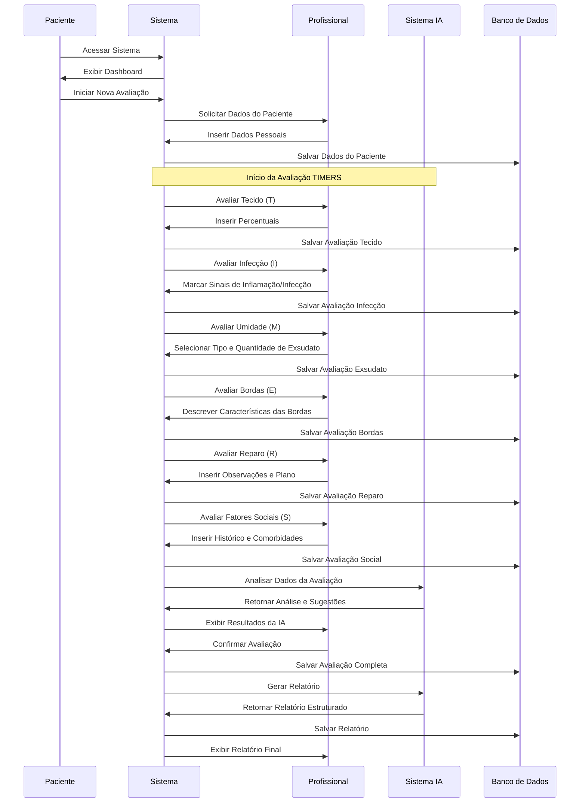

# Diagrama UML - Casos de Uso Principais Heal+

## Diagrama Simplificado dos Casos de Uso Principais

```mermaid
graph TB
    %% Atores
    Paciente[👤 Paciente]
    Profissional[👨‍⚕️ Profissional de Saúde]
    Administrador[👨‍💼 Administrador]
    SistemaIA[🤖 Sistema de IA]
    
    %% Casos de Uso Principais
    UC1[📝 Registrar Paciente]
    UC2[📅 Agendar Consulta]
    UC3[🔍 Realizar Avaliação TIMERS]
    UC4[📊 Gerar Relatório]
    UC5[📈 Analytics e Dashboard]
    UC6[🤖 Análise com IA]
    UC7[📋 Gerenciar Tratamentos]
    UC8[👥 Gerenciar Usuários]
    
    %% Sub-casos de uso para Avaliação TIMERS
    subgraph "Avaliação TIMERS Detalhada"
        UC3_1[T - Avaliar Tecido]
        UC3_2[I - Avaliar Infecção]
        UC3_3[M - Avaliar Umidade]
        UC3_4[E - Avaliar Bordas]
        UC3_5[R - Avaliar Reparo]
        UC3_6[S - Avaliar Fatores Sociais]
    end
    
    %% Sub-casos de uso para Relatórios
    subgraph "Tipos de Relatórios"
        UC4_1[Relatório Completo]
        UC4_2[Relatório Resumido]
        UC4_3[Relatório de Progressão]
        UC4_4[Comparar Relatórios]
    end
    
    %% Sub-casos de uso para Analytics
    subgraph "Analytics Detalhado"
        UC5_1[Visualizar Estatísticas]
        UC5_2[Analisar Tendências]
        UC5_3[Relatório de Performance]
        UC5_4[Exportar Dados]
    end
    
    %% Sub-casos de uso para IA
    subgraph "Funcionalidades de IA"
        UC6_1[Analisar Imagem da Ferida]
        UC6_2[Detectar Sinais de Infecção]
        UC6_3[Calcular Progressão]
        UC6_4[Sugerir Tratamento]
    end
    
    %% Relacionamentos Principais
    Paciente --> UC1
    Paciente --> UC2
    Paciente --> UC3
    Paciente --> UC4
    Paciente --> UC5
    
    Profissional --> UC1
    Profissional --> UC2
    Profissional --> UC3
    Profissional --> UC4
    Profissional --> UC5
    Profissional --> UC6
    Profissional --> UC7
    
    Administrador --> UC5
    Administrador --> UC6
    Administrador --> UC7
    Administrador --> UC8
    
    SistemaIA --> UC6
    SistemaIA --> UC4
    SistemaIA --> UC5
    
    %% Relacionamentos de Inclusão
    UC3 -.->|inclui| UC3_1
    UC3 -.->|inclui| UC3_2
    UC3 -.->|inclui| UC3_3
    UC3 -.->|inclui| UC3_4
    UC3 -.->|inclui| UC3_5
    UC3 -.->|inclui| UC3_6
    
    UC4 -.->|inclui| UC4_1
    UC4 -.->|inclui| UC4_2
    UC4 -.->|inclui| UC4_3
    UC4 -.->|inclui| UC4_4
    
    UC5 -.->|inclui| UC5_1
    UC5 -.->|inclui| UC5_2
    UC5 -.->|inclui| UC5_3
    UC5 -.->|inclui| UC5_4
    
    UC6 -.->|inclui| UC6_1
    UC6 -.->|inclui| UC6_2
    UC6 -.->|inclui| UC6_3
    UC6 -.->|inclui| UC6_4
    
    %% Relacionamentos de Extensão
    UC4 -.->|estende| UC6
    UC5 -.->|estende| UC6
    UC3 -.->|estende| UC6
    
    %% Estilos
    classDef ator fill:#e3f2fd,stroke:#1976d2,stroke-width:3px
    classDef casoUsoPrincipal fill:#f3e5f5,stroke:#7b1fa2,stroke-width:2px
    classDef subCasoUso fill:#e8f5e8,stroke:#388e3c,stroke-width:1px
    classDef grupo fill:#fff3e0,stroke:#f57c00,stroke-width:2px
    
    class Paciente,Profissional,Administrador,SistemaIA ator
    class UC1,UC2,UC3,UC4,UC5,UC6,UC7,UC8 casoUsoPrincipal
    class UC3_1,UC3_2,UC3_3,UC3_4,UC3_5,UC3_6,UC4_1,UC4_2,UC4_3,UC4_4,UC5_1,UC5_2,UC5_3,UC5_4,UC6_1,UC6_2,UC6_3,UC6_4 subCasoUso
```



## Diagrama de Sequência - Avaliação TIMERS



## Diagrama de Classes - Entidades Principais

```mermaid
classDiagram
    class Paciente {
        +idPaciente: INT
        +nomePaciente: VARCHAR
        +dataNascimento: DATE
        +telefone: VARCHAR
        +email: VARCHAR
        +profissao: VARCHAR
        +estadoCivil: ENUM
        +cpfPaciente: VARCHAR
        +registrar()
        +atualizar()
        +consultar()
    }
    
    class ProfissionalDeSaude {
        +idProfissional: INT
        +nomeProfissional: VARCHAR
        +especialidadeProfissional: VARCHAR
        +coren: VARCHAR
        +crm: VARCHAR
        +email: VARCHAR
        +telefone: VARCHAR
        +registrar()
        +atualizar()
        +autenticar()
    }
    
    class Consulta {
        +idConsulta: INT
        +idPaciente: INT
        +idProfissional: INT
        +dataConsulta: DATE
        +horaConsulta: TIME
        +situacaoConsulta: ENUM
        +observacoes: TEXT
        +agendar()
        +confirmar()
        +cancelar()
        +reagendar()
    }
    
    class Ferida {
        +idFerida: INT
        +idConsulta: INT
        +localFerida: VARCHAR
        +tipoFerida: VARCHAR
        +largura: DECIMAL
        +comprimento: DECIMAL
        +profundidade: DECIMAL
        +tempoEvolucao: VARCHAR
        +etiologia: ENUM
        +registrar()
        +atualizar()
        +consultar()
    }
    
    class AvaliacaoTecido {
        +idAvaliacaoTecido: INT
        +idFerida: INT
        +percentualGranulacao: INT
        +percentualEpitelizacao: INT
        +percentualEsfacelo: INT
        +percentualNecrose: INT
        +avaliar()
        +calcularTotal()
    }
    
    class AvaliacaoInfeccao {
        +idAvaliacaoInfeccao: INT
        +idFerida: INT
        +dorEscala: INT
        +dorFatores: TEXT
        +inflamacaoRubor: BOOLEAN
        +inflamacaoCalor: BOOLEAN
        +inflamacaoEdema: BOOLEAN
        +avaliar()
    }
    
    class RelatorioConsulta {
        +idRelatorio: INT
        +idConsulta: INT
        +descricaoAnalise: TEXT
        +recomendacoes: TEXT
        +dataGeracao: TIMESTAMP
        +gerar()
        +exportar()
        +compartilhar()
    }
    
    %% Relacionamentos
    Paciente ||--o{ Consulta : "tem"
    ProfissionalDeSaude ||--o{ Consulta : "realiza"
    Consulta ||--o{ Ferida : "avalia"
    Ferida ||--o{ AvaliacaoTecido : "tem"
    Ferida ||--o{ AvaliacaoInfeccao : "tem"
    Consulta ||--o{ RelatorioConsulta : "gera"
```

## Descrição dos Casos de Uso Principais

### **1. Registrar Paciente**
- **Atores**: Paciente, Profissional
- **Descrição**: Cadastro de novos pacientes no sistema
- **Fluxo**: Coleta de dados pessoais, validação e armazenamento

### **2. Agendar Consulta**
- **Atores**: Paciente, Profissional
- **Descrição**: Agendamento de consultas médicas
- **Fluxo**: Seleção de data/hora, confirmação e envio de lembretes

### **3. Realizar Avaliação TIMERS**
- **Atores**: Profissional, Sistema IA
- **Descrição**: Avaliação completa seguindo framework TIMERS
- **Fluxo**: Preenchimento sequencial dos 6 componentes do TIMERS

### **4. Gerar Relatório**
- **Atores**: Profissional, Sistema IA
- **Descrição**: Geração de relatórios baseados nas avaliações
- **Fluxo**: Análise de dados, formatação e exportação

### **5. Analytics e Dashboard**
- **Atores**: Profissional, Administrador
- **Descrição**: Visualização de métricas e estatísticas
- **Fluxo**: Coleta de dados, processamento e exibição gráfica

### **6. Análise com IA**
- **Atores**: Sistema IA
- **Descrição**: Processamento inteligente de imagens e dados
- **Fluxo**: Análise automática, detecção de padrões e sugestões

### **7. Gerenciar Tratamentos**
- **Atores**: Profissional
- **Descrição**: Prescrição e acompanhamento de tratamentos
- **Fluxo**: Seleção de terapias, equipamentos e insumos

### **8. Gerenciar Usuários**
- **Atores**: Administrador
- **Descrição**: Administração de usuários e permissões
- **Fluxo**: Criação, edição e controle de acesso
